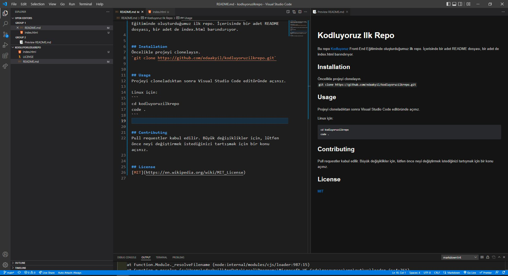

# Kodluyoruz Ilk Repo

Bu repo [Kodluyoruz](https://www.patika.dev/tr) Front-End Eğitiminde oluşturduğumuz ilk repo. İçerisinde bir adet README dosyası, bir adet de index.html barındırıyor.

My Project 


## Installation 
Öncelikle projeyi clonelayın. 
`git clone https://github.com/edaakyil/kodluyoruzilkrepo.git`


## Usage
Projeyi cloneladıktan sonra Visual Studio Code editöründe açınız.

Linux için:
```
cd kodluyoruzilkrepo
code .
```


## Contributing
Pull requestler kabul edilir. Büyük değişiklikler için, lütfen önce neyi değiştirmek istediğinizi tartışmak için bir konu açınız.


## License
[MIT](https://en.wikipedia.org/wiki/MIT_License)
